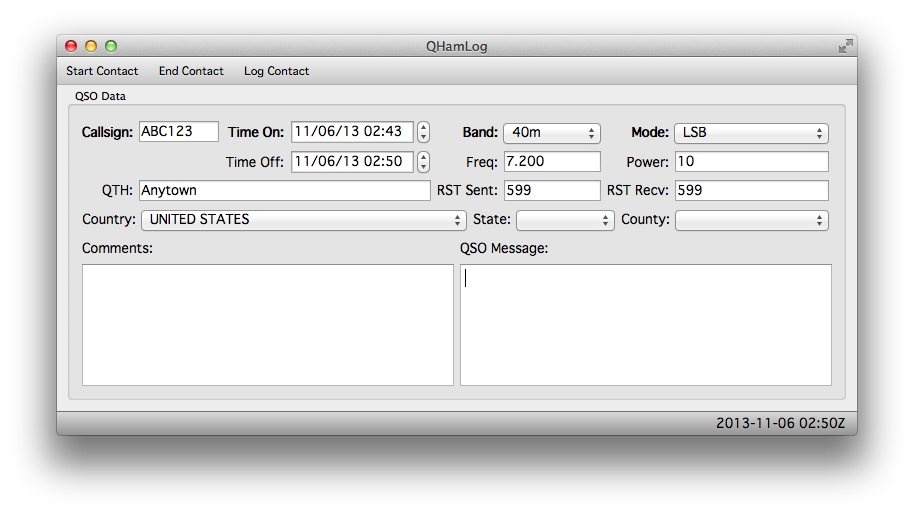

# QHamLog

_Simple, cross-platform, ADIF-compliant Amateur Radio QSO logging application_

After spending a while searching for a modern-looking open source Ham Radio contact logging
application, I was dismayed by the lack of choices. In an effort to fill this gap I created
QHamLog.

**Note**: QHamLog is in very early stages of development, and is very limited on functionality in
its current state. See the TODO section below for an idea of things that need work. I'm not going to
start tagging version numbers until a base set of features are done.

QHamLog will implement the Amateur Data Interchange Format (ADIF) version 3.0.4. For more
information on ADIF, see <http://adif.org/304/ADIF_304.htm>.

## Building

QHamLog is based on Qt, and should build and run on Windows, Mac, and Linux. That said...

QHamLog has currently only been built under the following setup:
* Mac OSX 10.9
* Qt Creator 2.8.1
* Qt 5.1.1

If you've successfully built under other setups, please let me know!

## TODO

**Base featureset**
- DB schema for log file
- Enter, validate, and log basic QSO information
- View and edit existing log file
- Export log file data to valid ADIF (.adi format) v3.0.4

**Someday...**
- Export log file data to valid ADIF (.adi and .adx formats), multiple versios
- Import log file data from ADIF (.adi and .adx formats), multiple versions
- Select specific records/fields to import/export

## License

Copyright 2013 Alex Gladd

QHamLog is licensed under the GPLv3

This program is free software: you can redistribute it and/or modify
it under the terms of the GNU General Public License as published by
the Free Software Foundation, either version 3 of the License, or
(at your option) any later version.

This program is distributed in the hope that it will be useful,
but WITHOUT ANY WARRANTY; without even the implied warranty of
MERCHANTABILITY or FITNESS FOR A PARTICULAR PURPOSE.  See the
GNU General Public License for more details.

You should have received a copy of the GNU General Public License
along with this program.  If not, see <http://www.gnu.org/licenses/>.
